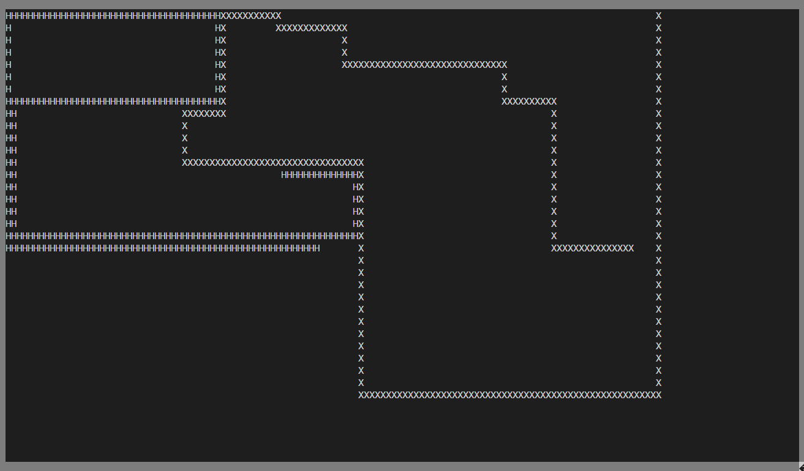

# jsnake-v1

This project is the first game and likely even full program I ever wrote in C. Its very rough around the edges but definitely playable.



## Features

1. Score keeping
2. Single-player mode (`[UP][LEFT][RIGHT][DOWN]` against computer)
3. Two-player mode (`wasd` and `[UP][LEFT][RIGHT][DOWN]`)

## Dependencies

Install `ncurses`. On debian based distros like ubuntu for example:

```bash
apt-get install libncurses5-dev
```

Install build tools. On debian based distros like ubuntu for example:

```bash
sudo apt install gcc make
```

## Play

The game expects an approximately 16x9 aspect ratio for the terminal. Make sure to resize the window as appropriate.

```bash
make
./jsnake.app
```


